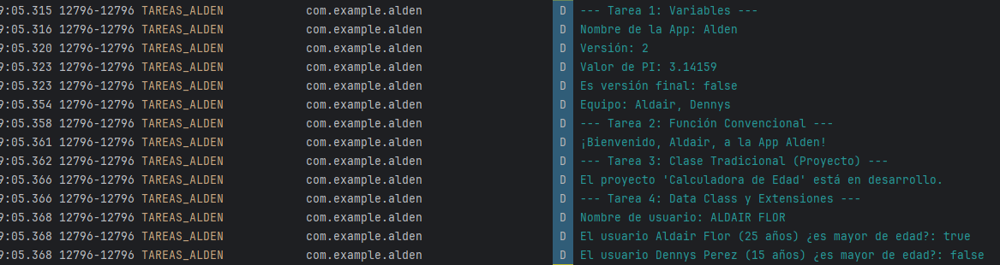
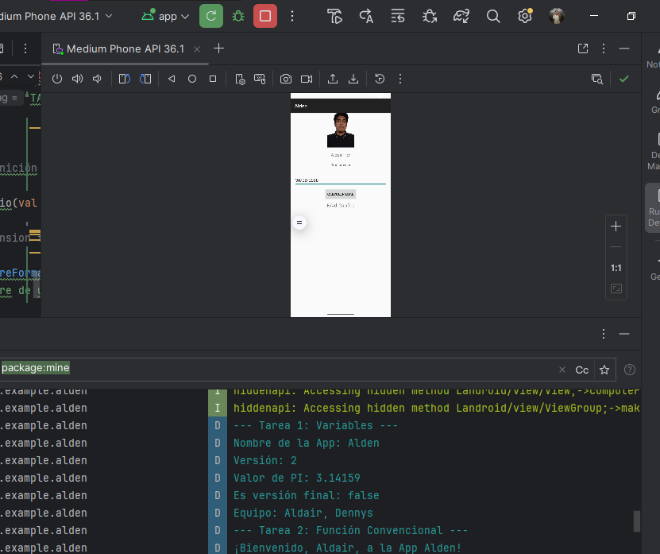

 AppGrupo01

## 📌 Nombre de la aplicación
**Alden**

## 🎯 Descripción breve del objetivo de la práctica
El objetivo de la práctica es comprender la sintaxis básica de Kotlin, comparándola con la de lenguajes como C# y JavaScript, y analizar sus ventajas y desventajas para el desarrollo de aplicaciones móviles.

## 📷 Capturas de pantalla
A continuación se presentan imágenes de la aplicación en ejecución:

## Tabla comparativa
A continuación, una tabla comparativa con las caracteristicas de los lenguajes Kotlin, C# y JavaScript.


| Aspecto | Kotlin | C# | JavaScript (ES2020+) |
|---|---|---|---|
| **Tipado de variables** | Estático y fuerte. `val` (inmutable), `var` (mutable). Inferencia de tipos. Null-safety con `?`, `?.`, `?:`. | Estático y fuerte. Inferencia local con `var`. `const` (solo constantes de compilación), `readonly` (inmutabilidad de campos). Nullability con `?`, `?.`, `??`. También existe `dynamic`. | Dinámico y débil (coerción). `const` (referencia inmutable), `let`, `var`. Optional chaining `?.` y nullish coalescing `??`. |
| **Funciones (convencionales)** | Funciones de **nivel superior** (no necesitan clase). Parámetros por defecto y con nombre. Sobrecarga. Lambdas y funciones de orden superior. **Extensiones**. | Métodos dentro de tipos; funciones locales y estáticas. Parámetros por defecto y con nombre. Sobrecarga. Delegados/LINQ/lambdas. **Métodos de extensión**. | Declaraciones y expresiones de función, *arrow functions*. Parámetros por defecto y `rest`/`spread`. No hay parámetros con nombre, se usa un **objeto** como parámetro. |
| **OOP (clases, herencia, interfaces)** | Clases `final` por defecto (`open` para heredar). Herencia simple + múltiples interfaces. `data class`, `sealed`, `object` (singleton), `companion`. | Clases heredables por defecto. Métodos `virtual`/`override`. Herencia simple + múltiples interfaces (métodos por defecto desde C# 8). `record` para datos. `struct` y `class`. | Prototipal con sintaxis `class`. Herencia simple con `extends`. No hay interfaces nativas (sí en TypeScript). Privados con `#`. Patrón *mixin*/duck typing para “contratos”. |
| **Colecciones** | `List`/`MutableList`, `Set`/`MutableSet`, `Map`/`MutableMap`. Operaciones funcionales (`map`, `filter`, `reduce`), **secuencias perezosas** (`Sequence`). | `IEnumerable<T>`, `List<T>`, `Dictionary<TKey,TValue>`, `HashSet<T>`. **LINQ** (método y consulta), `yield return`, colecciones inmutables (`System.Collections.Immutable`). | `Array`, `Map`, `Set`, objetos como diccionarios. Métodos `map`/`filter`/`reduce`. Iterables, `for…of`. Inmutabilidad por convención. |


## Ejemplos de código

**1)	Variables, inferencia y null-safety**
```
C#
// mutable
int edad = 30;
edad++;

// constante (compilación)
const int MaxIntentos = 3;

// inferencia (sigue siendo tipado estático)
var nombre = "Ada"; // string

// null-safety (equivalente a Kotlin: `val len = nombre?.length ?: 0`)
string? puedeSerNull = null;
int longitud = puedeSerNull?.Length ?? 0;
```

```
JS
let edad = 30;
edad++;

const MAX_INTENTOS = 3;

const nombre = "Ada"; // dinámico

// null-safety con optional chaining y nullish coalescing
const puedeSerNull = null;
const longitud = puedeSerNull?.length ?? 0; // (≈ Kotlin `?.` y `?:`)
```

**2)	Funciones con parámetros por defecto y “con nombre”**
```
C#
static int Sumar(int a, int b = 0) => a + b;

var r1 = Sumar(3);           // usa b=0
var r2 = Sumar(b: 10, a: 5); // argumentos con nombre
```
```
JS
function sumar(a, b = 0) { return a + b; }

const r1 = sumar(3);

// “con nombre” emulado con objeto
function mover({ x = 0, y = 0 } = {}) { return [x, y]; }
const p = mover({ y: 10 }); // (≈ Kotlin con argumentos con nombre)
```

**3)	Clases, herencia e interfaces**
```
C#
public interface IPet { void Cuddle(); }

public class Animal {
    public virtual string Speak() => "...";
}

public class Dog : Animal, IPet {
    public override string Speak() => "Guau";
    public void Cuddle() { /* ... */ }
}
```

```
JS
class Animal {
  speak() { return "..."; }
}

class Dog extends Animal {
  speak() { return "Guau"; } // override
  cuddle() { /* ... */ }
}

// "Contrato" tipo interfaz se suele documentar y comprobar por duck typing
function esPet(x) { return typeof x.cuddle === "function"; }
```
**4)	Colecciones y operaciones tipo map/filter/reduce**
```
C#
using System.Linq;
using System.Collections.Generic;

var nums = new List<int> { 1, 2, 3, 4 };
var resultado = nums
    .Select(n => n * 2)
    .Where(n => n > 4)
    .Sum(); // 12

var dict = new Dictionary<string,int> { ["a"] = 1, ["b"] = 2 };
int valor = dict.TryGetValue("c", out var v) ? v : 0; // (≈ Kotlin: map.getOrDefault)

var conjunto = new HashSet<int> { 1, 1, 2 }; // {1,2}
```

**5)	Manejo de null y encadenamiento seguro**
```
C#
string? email = null;
var dominio = email?.Split('@').LastOrDefault() ?? "sin-dominio";
JS
const email = null;
const dominio = email?.split("@")?.at(-1) ?? "sin-dominio";
```

**6) Null Safety (`?`, `?`., `?:`, `!!`)**

* `T?` → el valor puede ser nulo.

* `?.` (safe call) → accede solo si no es nulo; si no, devuelve `null`.

* `?:` (Elvis) → da un valor por defecto si es `null`.

* `!!` (non-null assertion) → fuerza a no nulo; si es `null`, lanza `KotlinNullPointerException`.

```
Kotlin
data class User(val id: Int, val name: String, val email: String?) // email puede ser null

fun nullSafetyDemo(u: User) {
    // Safe call + Elvis
    val domain = u.email?.substringAfter("@") ?: "sin-dominio"
    println("Dominio: $domain")

    // Alternativa segura a '!!'
    val emailSeguro = u.email ?: return println("No hay email")
    println("Email en mayúsculas: ${emailSeguro.uppercase()}")

    // '!!' (no recomendado) - ejemplo didáctico:
    // println(u.email!!.uppercase()) // ⚠️ lanzará excepción si email == null
}

```

**7) Data Classes**

Clases para modelar datos: generan `equals`, `hashCode`, `toString`, `copy`, `componentN` automáticamente.

```
Kotlin
data class Product(val id: String, val title: String, val price: Double)

fun dataClassDemo() {
    val p1 = Product("A1", "Teclado", 25.0)
    val p2 = p1.copy(price = 20.0)        // copia con un cambio
    val (id, title, price) = p2           // destructuring
    println(p1 == p2)                      // false (precio distinto)
    println("ID=$id, título=$title, precio=$price")
    println(p2)                            // toString legible
}

```
**8) Sealed Classes**

Jerarquías cerradas: el compilador exige `when` exhaustivo (si se agrega un caso, obliga a manejarlo).

```
sealed class Result<out T> {
    data class Success<T>(val data: T) : Result<T>()
    data class Error(val message: String, val cause: Throwable? = null) : Result<Nothing>()
    object Loading : Result<Nothing>()
}

fun <T> render(result: Result<T>): String = when (result) {
    is Result.Success -> "OK: ${result.data}"
    is Result.Error   -> "Error: ${result.message}"
    Result.Loading    -> "Cargando…"
}

// Ejemplo de uso:
fun fetchUserFromNetwork(ok: Boolean): Result<User> =
    if (ok) Result.Success(User(1, "Ana", "ana@ejemplo.com"))
    else    Result.Error("Fallo de red")

```
**9) Extension Functions**

Permiten añadir funciones a tipos existentes sin herencia ni wrappers.
Beneficios:

* Centralizan lógica repetida (evitan helpers estáticos sueltos).

* Hacen el código de llamada más expresivo: user.contactLine().

```
Kotlin
// Extensión sobre String? para mostrar un placeholder
fun String?.orPlaceholder(placeholder: String = "N/D"): String =
    this?.takeIf { it.isNotBlank() } ?: placeholder

// Extensión para extraer dominio de un email (o null si no tiene '@')
fun String.domainFromEmail(): String? = split("@").getOrNull(1)

// Extensión sobre tu modelo (mejor que repetir formato en cada vista)
fun User.contactLine(): String = "$name <${email.orPlaceholder("sin-email")}>"

// Extensión sobre colecciones para filtrar
fun List<User>.withEmail(): List<User> = filter { !it.email.isNullOrBlank() }

```
## Casos de uso comunes: C# y JavaScript
C# (.NET).
Se utiliza ampliamente en entornos empresariales para APIs y servicios robustos (ASP.NET Core), donde el tipado fuerte, el rendimiento y la integración con Microsoft (SQL Server, Active Directory, Azure) son prioridad. También es común en videojuegos gracias a Unity (publicación multiplataforma) y en escritorio con WPF/WinForms o soluciones multiplataforma como .NET MAUI y Avalonia.

JavaScript (frontend y Node.js).
Domina la web del lado del cliente con frameworks como React, Vue o Angular, y soporta SSR/SSG con Next.js/Nuxt para mejores tiempos de carga y SEO. En backend, Node.js es adecuado para I/O intensivo y tiempo real (WebSockets), microservicios y despliegues serverless, con un flujo “full-stack” unificado.

Elección:
C# encaja cuando se requiere gobernanza estricta de tipos, rendimiento y ecosistema Microsoft; JavaScript destaca cuando la prioridad es la rapidez de entrega web, tiempo real y un único lenguaje en todo el stack (idealmente con TypeScript para mayor seguridad)

## ✅ Conclusiones
1.  Kotlin aporta mayor seguridad y concisión. Su null safety (?, ?., ?:) y la inmutabilidad por defecto con val reducen errores en tiempo de ejecución y hacen el código más legible que en JS (dinámico) y, en muchos casos, más ergonómico que la anotación de nulabilidad de C#.

2.  Modelado de dominio más expresivo. Las data classes (con copy, equals, toString) y las sealed classes (exhaustividad en when) permiten representar estados/resultados de forma clara y con menos boilerplate que en JS; C# se acerca con record, pero Kotlin integra estos patrones de forma nativa y compacta.

3.  Las operaciones de la stdlib de Kotlin (map, filter, reduce, Sequence) ofrecen una experiencia similar a LINQ de C#, manteniendo tipado estático. JS tiene APIs comparables, pero al ser dinámico es más propenso a errores sutiles si no se acompaña de TypeScript.

4.  Las extension functions en Kotlin permiten ubicar la lógica donde se usa (p. ej., user.contactLine()), evitando utilidades estáticas dispersas. Esto, junto con funciones de nivel superior, favorece módulos más pequeños, testeables y legibles —ideal para apps móviles.

## 💡 Recomendaciones
1.  Preferir ?. y ?: (Elvis) y evitar !! salvo casos muy controlados. Para invariantes, usar requireNotNull/checkNotNull con mensajes claros.

2.  Representar resultados (éxito/error/cargando) y flujos de UI con sealed class y data class; exigir when exhaustivo para que el compilador ayude a detectar casos no manejados. 
## 📷 Capturas de pantalla
A continuación se presentan imágenes de la aplicación en ejecución:

  
 

## 📲 Archivo APK generado
Alden_Num02.apk
