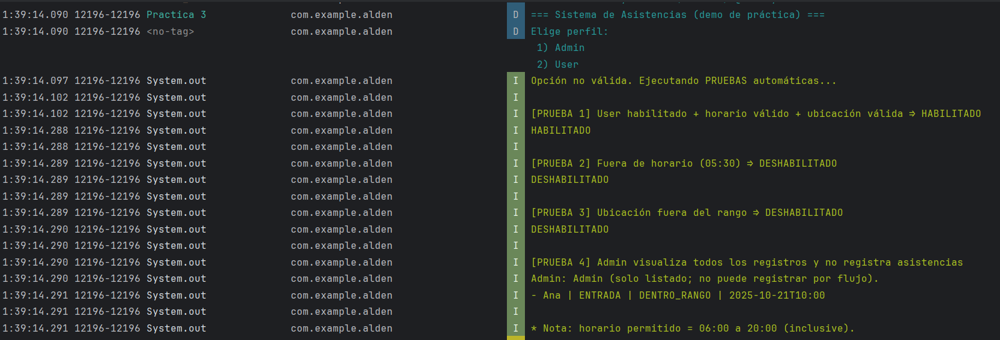

## 📌 Nombre de la aplicación
**Alden**

## 🎯 Descripción breve del objetivo de la práctica
Diseñar y construir, en Kotlin, un módulo de registro de asistencias con estructura modular (modelos, reglas y datos), usando funciones de orden superior y combinadores lógicos para definir las políticas.

## Matriz de casos
| ID | Rol   | Enabled | Hora (ej.) | Horario válido | Ubicación | Acción   | Esperado                           | ¿Se guarda? |
|----|-------|---------|------------|----------------|-----------|----------|------------------------------------|-------------|
| C1 | USER  | Sí      | 10:00      | Sí             | Dentro    | ENTRADA  | **HABILITADO**                     | Sí          |
| C2 | USER  | Sí      | 05:30      | **No**         | Dentro    | SALIDA   | **DESHABILITADO**                  | No          |
| C3 | USER  | Sí      | 10:15      | Sí             | **Fuera** | ENTRADA  | **DESHABILITADO**                  | No          |
| C4 | ADMIN | Sí      | 10:00      | Sí             | Dentro    | —        | **Lista visible, no registra**     | —           |

## ✅ Conclusiones
1.  La regla `canRegister = enabled ∧ horarioValido ∧ ubicacionValida` se comporta de forma determinista; solo el caso C1 resulta HABILITADO; C2 y C3 son DESHABILITADO, y el Admin (C4) no registra por flujo. La matriz de casos valida la verdad de la conjunción y facilita la trazabilidad evidencia-regla.

2.  Mantener el bloqueo de registro para Admin en el flujo/servicio (y no dentro de `canRegister`) simplifica las pruebas, hace la política reutilizable y reduce el acoplamiento entre autorización y validación de dominio..

3.  La estructura por carpetas (models, rules, services, data) y el uso de funciones de orden superior y combinadores lógicos (`and`, `or`, `not`) permiten componer reglas atómicas de forma legible y fácilmente ampliable.

4.  Al comparar por LocalTime (o por `hour/minute`) se definen correctamente los límites 06:00 y 20:00 (inclusivos). Las evidencias en consola/Logcat confirman que solo se guarda cuando la política habilita, preservando la integridad del repositorio en memoria.

## 💡 Recomendaciones
1.  Asegurar que los mensajes mostrados al usuario (HABILITADO/DESHABILITADO) sean claros y coherentes, e incorporar un instructivo paso a paso para registrar y consultar..

2.  Difundir, en una guía breve, que el Admin solo visualiza y el User registra asistencias. Incluir ejemplos simples (qué puede y qué no puede hacer cada perfil) para evitar malentendidos en el uso cotidiano.

## 📷 Capturas de pantalla
A continuación se presentan imágenes de la aplicación en ejecución:

## 📲 Archivo APK generado
Alden_03.apk
