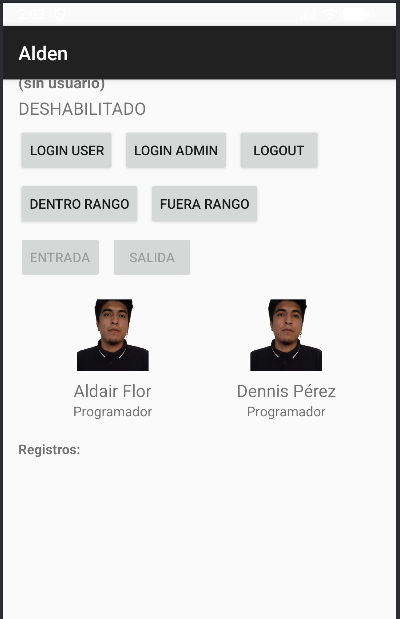
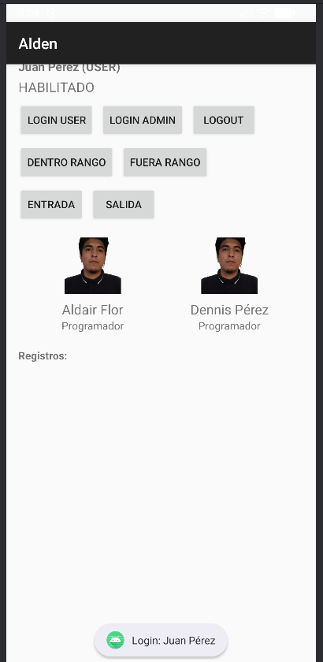
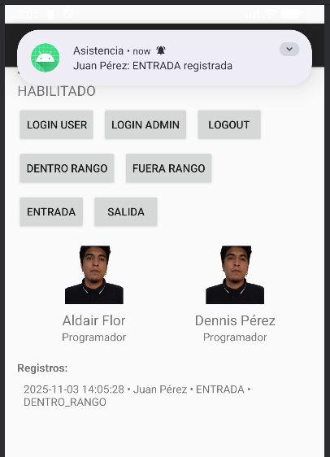
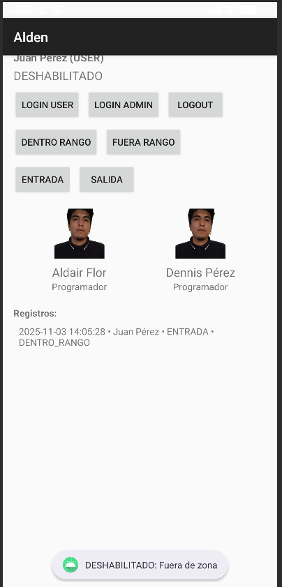
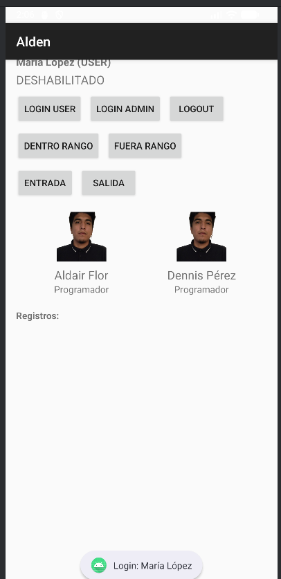
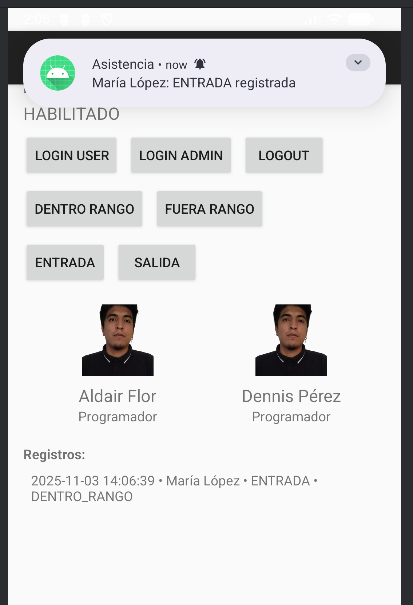
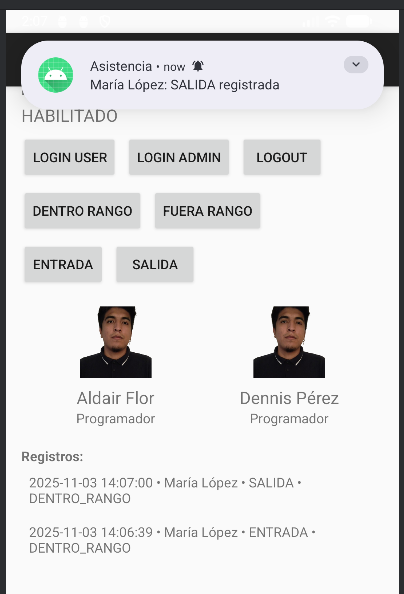
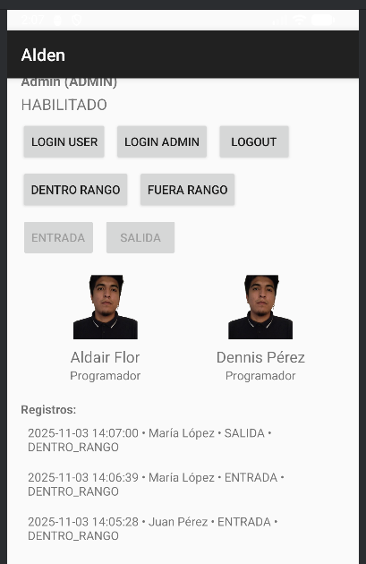

# 📌 Nombre de la aplicación
**Alden**

---

# 🎯 Descripción breve del objetivo de la práctica
Diseñar y construir un módulo de registro de asistencias con arquitectura modular (models, rules, services, data). Las políticas de habilitación se componen mediante funciones de orden superior y combinadores lógicos (`and`, `or`, `not`), para evaluar:
- **enabled** (usuario habilitado)
- **horarioVálido** (06:00–20:00, inclusivo)
- **ubicaciónVálida** (dentro del perímetro autorizado)

La regla principal es:

**canRegister = enabled ∧ horarioVálido ∧ ubicaciónVálida**

---

# 🧪 Matriz de casos funcionales
| ID | Rol   | Enabled | Hora (ej.) | Horario válido | Ubicación | Acción   | Estado (regla)      | ¿Se guarda? |
|----|-------|---------|------------|----------------|-----------|----------|---------------------|-------------|
| C1 | USER  | Sí      | 10:00      | Sí             | Dentro    | ENTRADA  | **HABILITADO**      | Sí          |
| C2 | USER  | Sí      | 05:30      | **No**         | Dentro    | SALIDA   | **DESHABILITADO**   | No          |
| C3 | USER  | Sí      | 10:15      | Sí             | **Fuera** | ENTRADA  | **DESHABILITADO**   | No          |
| C4 | ADMIN | Sí      | 10:00      | Sí             | Dentro    | —        | **Solo visualiza**  | —           |

> Límite horario: **06:00 ≤ hora ≤ 20:00**.

---

# 🔔 Matriz de casos de prueba (estado ↔ mensaje ↔ canal de notificación)
> Se definen tres canales de entrega: **UI** (Snackbar/Toast), **Sistema** (Notificación local) y **Log** (Logcat).

| ID | Estado | Código de mensaje | Mensaje UI (usuario)                                   | Canal UI      | Canal Sistema (Notificación) | Canal Log (nivel)       |
|----|--------|-------------------|--------------------------------------------------------|---------------|-------------------------------|-------------------------|
| C1 | HABILITADO | `REGISTRO_OK`        | ✅ *Asistencia registrada correctamente.*                | Snackbar      | **Sí** (confirmación breve)   | INFO `Registro OK`      |
| C2 | DESHABILITADO | `FUERA_DE_HORARIO`  | ⏰ *Fuera de horario (permitido 06:00–20:00).*           | Snackbar      | No                            | WARN `Fuera de horario` |
| C3 | DESHABILITADO | `FUERA_DE_UBICACION`| 📍 *Fuera de la ubicación autorizada.*                   | Snackbar      | No                            | WARN `Geo inválida`     |
| C4 | Solo visualiza | `ROL_SOLO_LECTURA`  | 🔒 *Perfil Admin: solo visualización de registros.*      | Toast         | No                            | INFO `Admin read-only`  |

### Convenciones de notificación
- **UI (Snackbar/Toast):** feedback inmediato, no intrusivo.
- **Sistema (Notificación local):** se usa **solo en éxito (C1)** para dar confirmación persistente; se evita en denegados para no generar ruido.
- **Logcat:** registro técnico para trazabilidad (INFO en éxito, WARN en denegado).

---

# ✅ Conclusiones
1. La política `canRegister = enabled ∧ horarioVálido ∧ ubicaciónVálida` es **determinista**: únicamente el caso **C1** habilita registro; **C2** y **C3** lo bloquean; **C4** no registra por flujo (rol Admin).
2. Separar **autorización de flujo** (Admin solo visualiza) de la **validación de dominio** (regla) reduce acoplamiento, simplifica tests y facilita la reutilización de la regla en otros contextos.
3. La arquitectura por módulos y el uso de **composición de reglas** con combinadores lógicos hacen el código **legible, testeable y extensible**.
4. Con límites bien definidos (06:00 y 20:00, inclusivos) y verificación de ubicación, el sistema **preserva la integridad**: solo se persiste cuando la política habilita.
5. La **matriz estado ↔ mensaje ↔ canal** garantiza una **experiencia consistente** y una **trazabilidad clara** entre lo que sucede, lo que ve el usuario y lo que queda en logs.

---

# 💡 Recomendaciones
1. Mantener textos breves, positivos y accionables. Ej.: indicar el motivo exacto del bloqueo (horario/ubicación).
2. Usar Snackbar para información inmediata y limitar notificaciones del sistema a éxitos (o eventos realmente críticos).

---

# 📷 Capturas de pantalla
A continuación se presentan imágenes de la aplicación en ejecución:

---
Pantalla principal de la aplicacion

---
Login del usuario Juan Pérez

---
Se elige DENTRO RANGO y luego ENTRADA para registrar la entrada del usuario

---
Si se elige FUERA RANGO y se intenta registrar, sale un mensaje de DESHABILITADO

---
Se hace login de la usuario Maria Lopez

---
Se hace un registro de su entrada

---
Se hace un registro de su salida

---
El administrador puede ver todos los registros

---

# 📲 Archivo APK generado
`Alden_04.apk`

