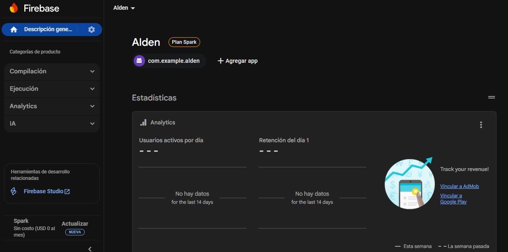
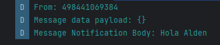
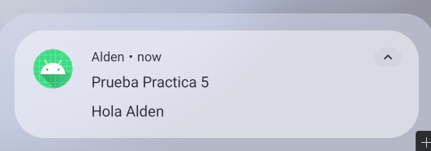

# Alden (App de Asistencia)

## Descripción de la Práctica

El objetivo de esta práctica fue integrar **Firebase Cloud Messaging (FCM)** en la aplicación "Alden" para gestionar el envío y recepción de notificaciones *push*.

La práctica se centró en la implementación de un `FirebaseMessagingService` capaz de procesar **mensajes de solo-datos ("data payload")**. Esto permite a la aplicación recibir información personalizada (como `title`, `body` y `channel`) y tener control total sobre cómo y cuándo se muestra la notificación, independientemente de si la app está en primer plano, segundo plano o cerrada.

La implementación clasificó las notificaciones en dos canales personalizados: "Asistencia" (prioridad normal) y "Alertas" (prioridad alta).

## Matriz de Casos de Prueba

Se ejecutaron los siguientes casos de prueba para validar la implementación de FCM.

| ID | Caso de Prueba | Datos Enviados (Data Payload) | Resultado Esperado | Resultado Obtenido |
| :--- | :--- | :--- | :--- | :--- |
| **P-01** | Mensaje de "Asistencia" (App abierta) | `{ "channel": "asistencia", "title": "...", "body": "..." }` | La app muestra una notificación local. El log (`MyFCM`) confirma el uso del canal `asistencia_v2`. | **OK** |
| **P-02** | Mensaje de "Alerta" (App abierta) | `{ "channel": "alerta", "title": "¡ALERTA!", "body": "..." }` | La app muestra una notificación *heads-up* (prioridad alta). El log confirma el uso del canal `alertas_v2`. | **OK** |
| **P-03** | Mensaje (App en 2º plano) | `{ "channel": "asistencia", ... }` | La notificación aparece en la bandeja del sistema. El log (`MyFCM`) se activa en segundo plano. | **OK** |
| **P-04** | Mensaje (App cerrada / "Killed") | `{ "channel": "alerta", ... }` | El sistema operativo inicia el proceso de la app, el `Service` se ejecuta y la notificación aparece en la bandeja. | **OK** |

## Conclusiones y Recomendaciones

### Conclusiones

1.  **Control Total con Mensajes de Datos:** El uso de *payloads* de solo-datos (`"data": {}`) fue un éxito. Permitió que el `MyFirebaseMessagingService` interceptara **todos** los mensajes, dando control total sobre la lógica de la notificación sin importar el estado de la app (abierta, fondo, cerrada).
2.  **Canales de Notificación Funcionales:** La creación de canales (`CH_ASISTENCIA`, `CH_ALERTAS`) en la clase `AldenApplication` aseguró que estuvieran disponibles antes de que el `Service` los necesitara, funcionando correctamente. Los mensajes de "Alerta" se mostraron con la prioridad alta esperada.
3.  **Robustez en Segundo Plano:** La prueba P-04 (app cerrada) fue la más crítica y exitosa. Demostró que el sistema operativo despierta el servicio para procesar el mensaje, lo cual es fundamental para la funcionalidad de la app.

### Recomendaciones

1.  **Integración con Backend:** El siguiente paso natural es mover el envío de mensajes de la consola de Firebase a un *backend* (ej. Cloud Functions o un servidor propio). Esto permitirá enviar notificaciones personalizadas a usuarios específicos (usando sus tokens FCM) basadas en la lógica de negocio real (ej. "entrada registrada", "intento de acceso fallido").
2.  **Manejo de Clics (PendingIntent):** Actualmente, las notificaciones solo se muestran. Se debe implementar un `PendingIntent` en el `NotificationCompat.Builder` para que, al hacer clic en la notificación, se abra `MainActivity` (o una pantalla específica), pasando la información relevante del mensaje (`data`).
3.  **Sincronización de Tokens:** El método `onNewToken` en el servicio actualmente solo muestra el token en el log. Es crucial implementar la lógica para enviar este token al *backend* y asociarlo con el usuario (ej. `adminDemo`, `userDemo`) cada vez que se genere o actualice.

### Capturas

# 📲 Archivo APK generado
`Alden_05.apk`

