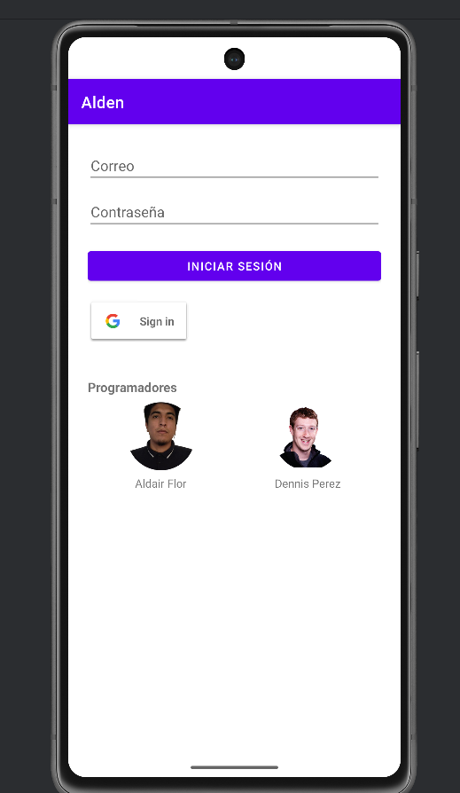
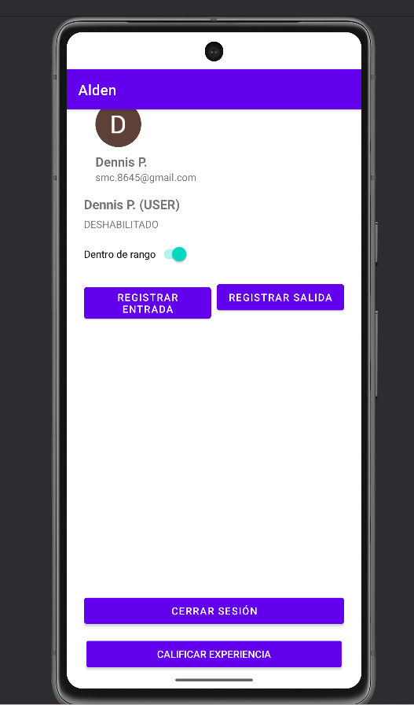
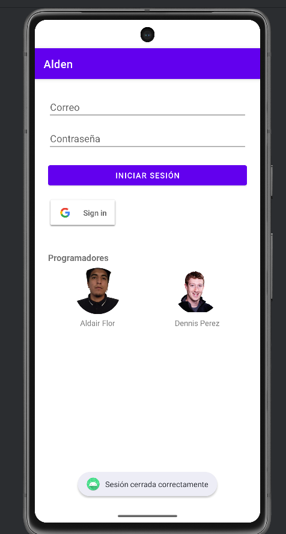

# Alden (App de Asistencia)

## Descripción de la Práctica

El objetivo de esta práctica fue integrar **Google Sign-In** con **Firebase Authentication** en la aplicación "Alden" para gestionar el inicio y cierre de sesión de usuarios mediante sus credenciales de Google.

La práctica se enfocó en implementar el flujo completo de autenticación: configuración del proveedor "Google" en Firebase, solicitud de credenciales desde la app usando el botón oficial de Google Sign-In, manejo del resultado del inicio de sesión y autenticación final en Firebase mediante `GoogleAuthProvider`.

Como resultado, la aplicación es capaz de **identificar al usuario autenticado** y mostrar correctamente su información de perfil: **nombre**, **correo electrónico** y **foto** (si está disponible). Adicionalmente, se implementó la opción de **cerrar sesión**, invalidando la sesión tanto en Firebase como en Google.

## Matriz de Casos de Prueba

Se ejecutaron los siguientes casos de prueba para validar la integración de Google Sign-In.

| ID | Caso de Prueba | Datos de Entrada | Resultado Esperado | Resultado Obtenido |
| :--- | :--- | :--- | :--- | :--- |
| **P-01** | Inicio de sesión correcto | Cuenta Google válida | La app autentica con Google, inicia sesión en Firebase y redirige a la pantalla principal. | **OK** |
| **P-02** | Visualización del perfil | Usuario autenticado | En la pantalla principal se muestran: nombre, correo y foto (si existe). | **OK** |
| **P-03** | Cierre de sesión | Botón "Cerrar sesión" | Se cierra sesión en Firebase y Google; el usuario deja de estar autenticado. | **OK** |

## Conclusiones y Recomendaciones

### Conclusiones

1. **Flujo completo de autenticación funcional:** La integración de Google Sign-In con FirebaseAuth fue exitosa. El flujo de obtención de credenciales, manejo del resultado y autenticación con `signInWithCredential` permitió un acceso confiable usando cuentas Google.
2. **Perfil de usuario accesible y consistente:** La extracción de información desde `FirebaseAuth.currentUser` (nombre, email y foto) funcionó correctamente, permitiendo mostrar datos del perfil dentro de la interfaz principal.
3. **Cierre de sesión efectivo:** Al implementar `FirebaseAuth.signOut()` junto con `GoogleSignInClient.signOut()`, se logró invalidar la sesión correctamente, evitando accesos no deseados al reabrir la app sin iniciar sesión nuevamente.

### Recomendaciones

1. **Registrar SHA-1 para debug y release:** Para asegurar que el inicio de sesión funcione tanto en modo desarrollo como en un APK (release), se recomienda registrar en Firebase los SHA-1 correspondientes a ambas firmas.
2. **Manejo de errores y cancelaciones:** Se recomienda robustecer el manejo de casos donde el usuario cancela el login o ocurre un error (`ApiException`), mostrando mensajes claros y registrando logs para diagnóstico.
3. **Control de navegación inicial:** Como mejora, se sugiere implementar una pantalla de arranque (*launcher/splash*) que verifique automáticamente si existe un usuario autenticado y redirija a la vista correcta (login o principal).

### Capturas

# 📲 Archivo APK generado
`Alden_06.apk`

