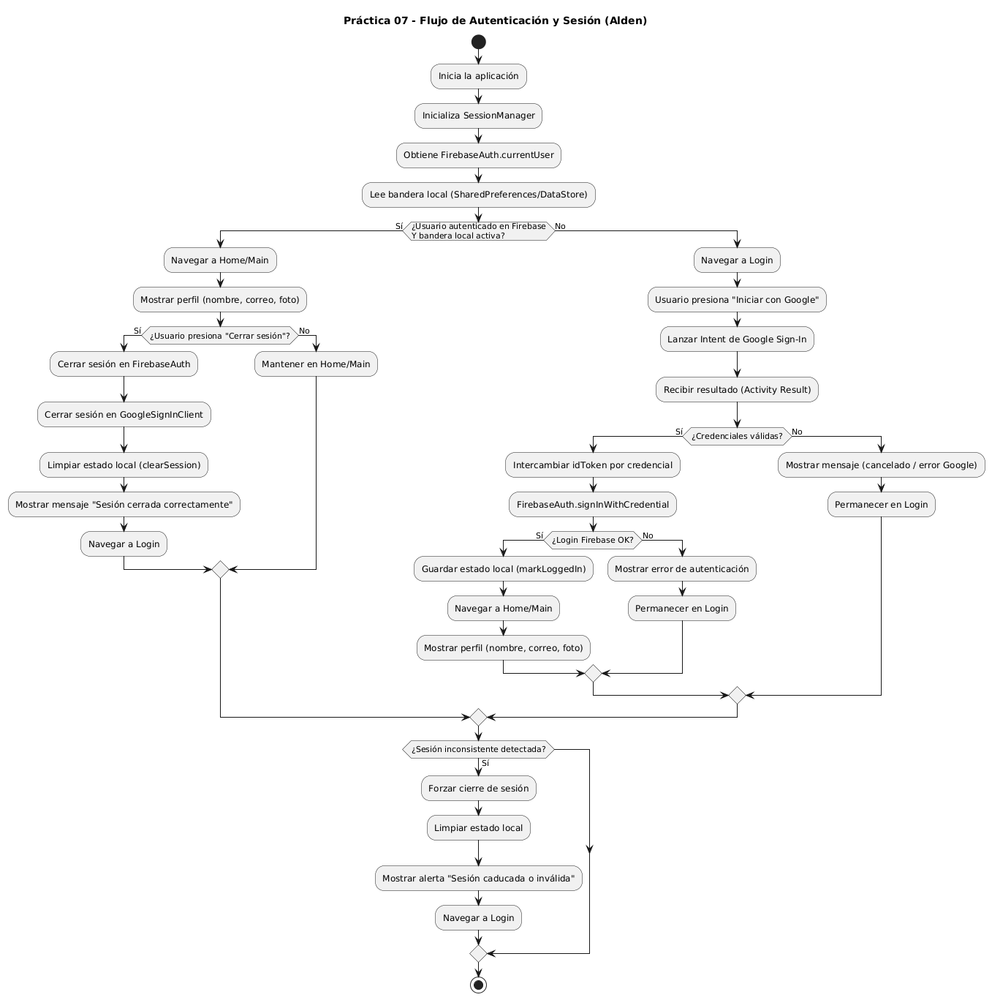

# Alden (App de Asistencia)

## Descripción de la Práctica 7

El objetivo de esta práctica fue implementar el **manejo del estado de sesión** en la aplicación "Alden", utilizando **FirebaseAuth** (y la autenticación previa con Google Sign-In) para verificar si el usuario se encuentra autenticado y redirigirlo automáticamente a la pantalla correspondiente.

La práctica se centró en validar la sesión activa al iniciar la aplicación, aplicando una lógica de navegación que permite:

- Redirigir al usuario a la pantalla principal si existe una sesión activa.
- Mostrar la pantalla de login si el usuario no está autenticado.
- Implementar el cierre de sesión, limpiando el estado local y eliminando credenciales para evitar accesos no autorizados.

Adicionalmente, se incorporó persistencia local para registrar el estado de inicio/cierre de sesión y asegurar un control coherente ante cierres forzados, reinicios y reinstalaciones, siguiendo buenas prácticas de seguridad y control de acceso.

## Diagrama del flujo de autenticación y sesión

El flujo general implementado se resume en el siguiente diagrama:

## Matriz de Casos de Prueba

Se ejecutaron los siguientes casos de prueba para validar el flujo completo de sesión (inicio, persistencia y cierre).

| ID | Caso de Prueba | Escenario | Resultado Esperado | Resultado Obtenido |
| :--- | :--- | :--- | :--- | :--- |
| **P-01** | Sesión persistente | Login exitoso → cerrar app → abrir app | La app detecta sesión activa y entra directo a la pantalla principal. | **OK** |
| **P-02** | Cierre de sesión y redirección | Usuario autenticado → cerrar sesión | Se eliminan credenciales, se limpia estado y se redirige a login inmediatamente. | **OK** |
| **P-03** | No autenticado | Abrir app sin sesión | La app muestra login (no permite acceso a la pantalla principal). | **OK** |
| **P-04** | Reinicio / cierre forzado | Sesión activa → cierre forzado → abrir | Se mantiene comportamiento correcto según sesión (home si sigue autenticado). | **OK** |

## Conclusiones y Recomendaciones

### Conclusiones

1. **Validación automática de sesión implementada:** El uso de `FirebaseAuth.currentUser` permitió comprobar de forma inmediata si existe un usuario autenticado y dirigir al usuario a la pantalla correspondiente al iniciar la app.
2. **Navegación coherente y segura:** La lógica de redirección evitó que usuarios no autenticados accedan a vistas internas, fortaleciendo el control de acceso del sistema.
3. **Cierre de sesión completo y confiable:** Al limpiar el estado local y cerrar sesión en Firebase/Google, se garantizó que la aplicación no mantenga credenciales residuales, cumpliendo los escenarios críticos de seguridad.

### Recomendaciones

1. **Evitar almacenar tokens o datos sensibles:** Si se usa persistencia local, se recomienda guardar únicamente banderas de estado (ej. `logged_in`) y nunca almacenar tokens/credenciales de forma accesible.
2. **Agregar expiración o verificación adicional:** Para mayor robustez, se recomienda manejar eventos donde Firebase invalida sesión (revocación, cambio de contraseña), mostrando alertas y forzando reautenticación.
3. **Proteger pantallas internas:** Se recomienda centralizar un *guard* de navegación (por ejemplo, en una pantalla de arranque o en el `NavGraph`) para impedir el acceso a pantallas internas mediante *back stack* o *deep links* sin sesión.

### Capturas

# 📲 Archivo APK generado
`Alden_07.apk`

