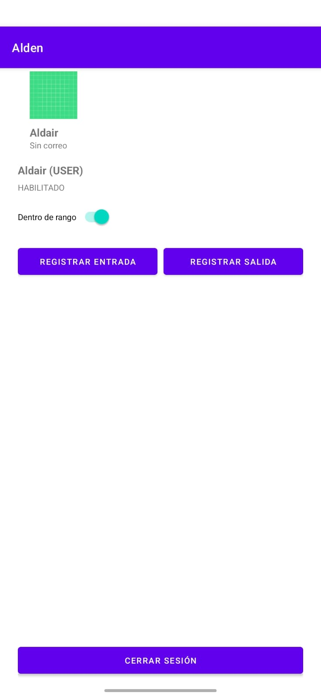
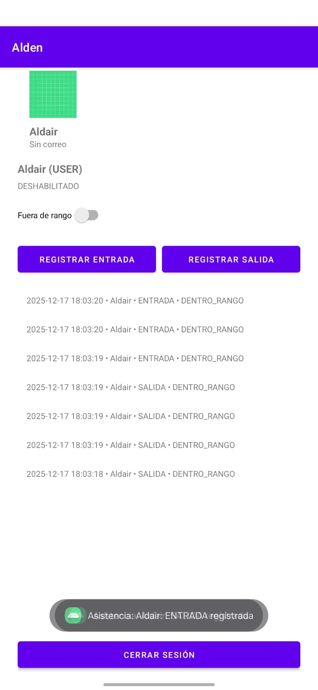

# Alden (App de Asistencia)

## 1. Descripción del Objetivo
[cite_start]El objetivo principal de esta práctica fue implementar mecanismos de seguridad en la aplicación "Control de Asistencia EPN" para garantizar la protección de pantallas según el rol del usuario[cite: 6]. [cite_start]Se establecieron controles para asegurar que solo usuarios autenticados accedan a secciones internas [cite: 7] [cite_start]y evitar que usuarios sin privilegios ingresen a pantallas administrativas[cite: 8].

[cite_start]Además, se implementó una navegación segura impidiendo el retorno a pantallas privadas después de cerrar sesión [cite: 9] [cite_start]y se aplicaron medidas de protección visual (FLAG_SECURE) para evitar la captura de datos sensibles[cite: 10].

## 2. Tabla de Permisos (User vs Admin)

La siguiente tabla resume el esquema de permisos implementado en el módulo de control de acceso:

| Acción / Pantalla | Rol: Usuario (User) | Rol: Administrador (Admin) |
| :--- | :--- | :--- |
| **Registrar Asistencia** | ✅ **Permitido** (Botones habilitados) | 🚫 **Denegado** (Bloqueo lógico y visual) |
| **Visualizar Registros** | ⚠️ **Parcial** (Solo registros propios) | ✅ **Total** (Todos los registros) |
| **Captura de Pantalla** | ✅ **Permitido** | 🚫 **Bloqueado** (Protección visual activa) |
| **Acceso a Dashboard** | ✅ Permitido | ✅ Permitido |
| **Navegación (Logout)** | ✅ Limpieza de Back Stack | ✅ Limpieza de Back Stack |

## 3. Conclusiones
* [cite_start]Se logró implementar exitosamente la protección visual mediante `FLAG_SECURE` en las pantallas de administración, impidiendo la captura de datos sensibles y ocultando el contenido en la vista de aplicaciones recientes[cite: 28, 53].
* [cite_start]La implementación del cierre de sesión limpiando el *back stack* garantiza que la navegación sea segura, cumpliendo con el requisito de evitar el retorno a pantallas protegidas mediante el botón "Atrás"[cite: 26, 49].
* [cite_start]La centralización de la lógica de seguridad en la carpeta `accesscontrol` permitió validar de forma modular si el usuario tiene sesión activa y si su rol coincide con los permisos requeridos por la pantalla[cite: 19, 20, 21].
* [cite_start]Se verificó que la protección debe ser integral, validando permisos tanto en la capa de interfaz de usuario (ocultando botones) como en la lógica de negocio (ViewModel) para evitar accesos no autorizados[cite: 24].

## 4. Recomendaciones
* Se recomienda realizar las pruebas de protección visual (bloqueo de capturas) en dispositivos físicos, ya que el comportamiento de `FLAG_SECURE` puede variar en emuladores dependiendo de la versión de Android y el host.
* [cite_start]Es aconsejable mantener la validación de sesión al inicio de cada *Activity* protegida (`onStart` o `onCreate`) para redirigir al Login inmediatamente si la sesión ha caducado o es inválida[cite: 45].
* [cite_start]Se sugiere implementar retroalimentación visual clara (como mensajes *Toast*) cuando se deniega una acción por falta de privilegios, mejorando la experiencia de usuario y clarificando las restricciones de seguridad[cite: 47].
### Capturas

# 📲 Archivo APK generado
`Alden_08.apk`

