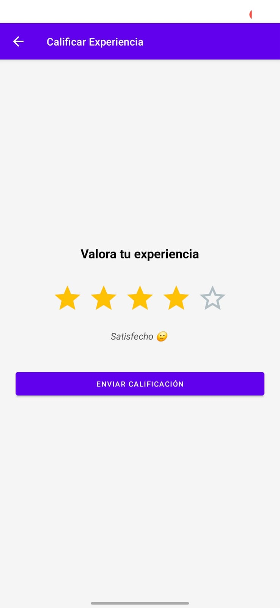
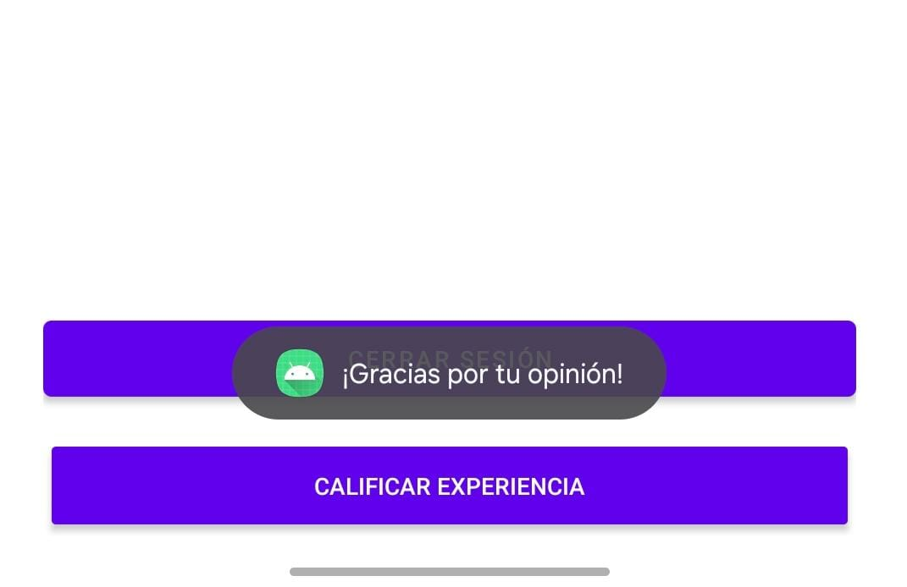

# Alden (App de Asistencia)
# Informe Práctica 09: Implementación de Vista de Rating

## 1. Descripción del Objetivo
El objetivo de esta práctica fue desarrollar e integrar un módulo de **calificación de experiencia de usuario (Rating)** dentro de la aplicación. Se diseñó una interfaz gráfica interactiva compuesta por 5 elementos visuales (estrellas) que permiten al usuario valorar la aplicación.

El módulo cumple con los siguientes requerimientos técnicos y funcionales:
* Implementación de lógica de interacción visual (llenado de estrellas y mensajes dinámicos).
* Validación de entrada (habilitar botón de envío solo tras selección).
* Persistencia de datos utilizando almacenamiento local (**SharedPreferences**) a través de un Repositorio.
* Integración con la arquitectura **MVVM** existente (uso de `StateFlow` para gestión de estado).
* Protección de la pantalla mediante el módulo de seguridad `ScreenGuard` implementado previamente.

## 2. Matriz de Casos de Prueba

A continuación se detallan las pruebas realizadas para verificar el correcto funcionamiento del módulo:

| ID | Escenario de Prueba | Resultado Esperado | Estado |
| :--- | :--- | :--- | :--- |
| **CP-01** | **Interacción Visual:** Usuario toca la 3ra estrella. | Las estrellas 1, 2 y 3 se iluminan. El mensaje cambia a "Neutral 😐". | ✅ Pasó |
| **CP-02** | **Modificación:** Usuario cambia de 3 a 5 estrellas. | Todas las estrellas se iluminan. El mensaje cambia a "Excelente experiencia 🤩". | ✅ Pasó |
| **CP-03** | **Validación de Botón:** Estado inicial y post-selección. | El botón "Enviar" inicia deshabilitado. Se habilita tras seleccionar cualquier estrella. | ✅ Pasó |
| **CP-04** | **Persistencia:** Clic en "Enviar Calificación". | Se muestra mensaje de agradecimiento, se guarda el valor en `SharedPreferences` y retorna al Dashboard. | ✅ Pasó |
| **CP-05** | **Seguridad:** Acceso directo sin sesión activa. | El sistema detecta la falta de sesión mediante `ScreenGuard` y redirige al Login inmediatamente. | ✅ Pasó |
| **CP-06** | **Integración Dashboard:** Navegación. | El botón "Calificar experiencia" es visible en el Dashboard y redirige correctamente a la vista de Rating. | ✅ Pasó |

## 3. Conclusiones
* **Gestión de Estado Reactiva:** El uso de `StateFlow` en el `RatingViewModel` facilitó la sincronización instantánea entre la lógica de negocio y la interfaz de usuario (UI), permitiendo que las estrellas y los mensajes de feedback reaccionen en tiempo real sin manipular directamente las vistas desde la Activity.
* **Persistencia Ligera:** Para datos sencillos y puntuales como una calificación numérica asociada a un usuario, el uso de `SharedPreferences` (encapsulado en un Repositorio) demostró ser una solución eficiente y suficiente, evitando la sobrecarga de una base de datos completa.
* **Reutilización de Seguridad:** La arquitectura modular del proyecto permitió reutilizar el componente `ScreenGuard` (de la práctica anterior) en la nueva `RatingActivity` sin necesidad de duplicar código, garantizando la consistencia en la seguridad de la aplicación.
* **Experiencia de Usuario (UX):** La implementación de feedback visual inmediato (cambio de color en iconos y mensajes de texto dinámicos) mejora significativamente la interacción del usuario en comparación con controles de entrada estándar.

## 4. Recomendaciones
* **Escalabilidad del Almacenamiento:** Si en el futuro se desea realizar análisis de datos o métricas globales de satisfacción, se recomienda migrar la persistencia de `SharedPreferences` a una base de datos en la nube (como Firebase Firestore) para centralizar las calificaciones de todos los usuarios.
* **Feedback Cualitativo:** Sería recomendable añadir un campo de texto opcional en la vista de rating para que el usuario pueda dejar comentarios específicos junto con su puntuación de estrellas, proporcionando información más rica para la mejora de la app.
* **Animaciones:** Para mejorar aún más la interfaz, se podría implementar una animación de transición (`Scale` o `Fade`) al momento de seleccionar las estrellas, haciendo la interacción más fluida y atractiva.

### Capturas

# 📲 Archivo APK generado
`Alden_09.apk`

