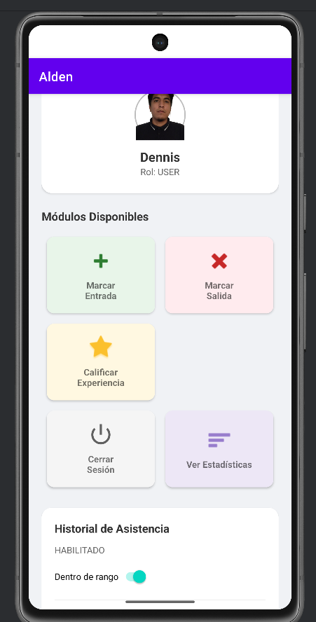
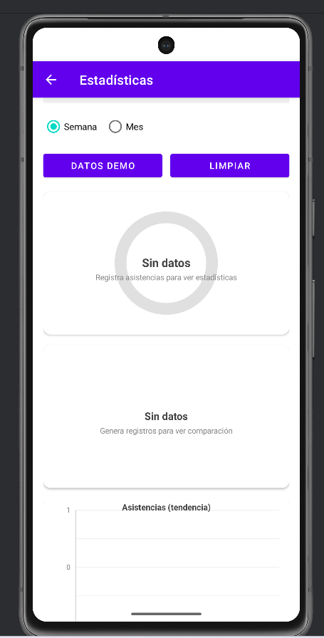
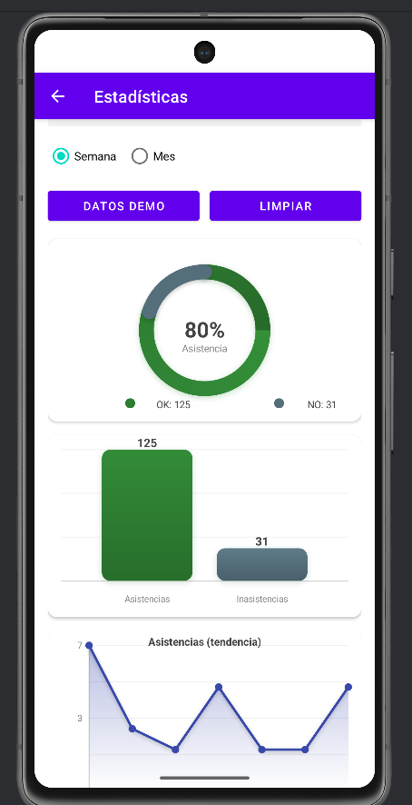
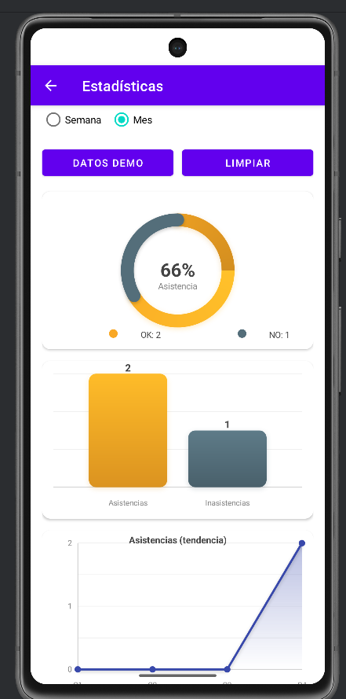

# Alden (App de Asistencia)
# Informe Práctica 10: Visualización de Datos en Gráficos con Canvas y Efectos

## 1. Descripción del Objetivo
El objetivo de esta práctica fue implementar una pantalla de **visualización de estadísticas** dentro de la aplicación *Alden*, utilizando gráficos personalizados dibujados manualmente con **Canvas** y **Paint** en Android.

La implementación cumple con los requerimientos técnicos y funcionales:
- Creación de una pantalla “**Estadísticas**” accesible desde el Dashboard.
- Visualización de datos mediante gráficos personalizados:
  - **Gráfico circular**: porcentaje de asistencia (asistencias vs inasistencias).
  - **Gráfico de barras**: comparación asistencias vs inasistencias.
  - **Gráfico de líneas**: asistencias por periodo (Semana/Mes).
- Cálculo de escalas, proporciones y posiciones usando sistema de coordenadas.
- Aplicación de **efectos visuales**: colores dinámicos, sombras/gradientes, suavizado y animación.
- Persistencia de datos con **SharedPreferences** (estadísticas actualizadas según registros).
- Protección de acceso: **sin sesión → redirigir a Login**, con sesión → mostrar gráficos.

---

## 2. Capturas de la Funcionalidad (Gráficos)

---

## 3. Matriz de Casos de Prueba

| ID | Escenario de Prueba | Datos / Condición | Resultado Esperado | Estado |
| :--- | :--- | :--- | :--- | :--- |
| **CP-01** | **Navegación:** Acceso a “Ver Estadísticas” desde Dashboard | Usuario con sesión activa | Se abre la pantalla Estadísticas correctamente | ✅ Pasó |
| **CP-02** | **Protección:** Acceso sin sesión activa | Cerrar sesión y entrar directo a Estadísticas | Redirige automáticamente a Login | ✅ Pasó |
| **CP-03** | **Datos vacíos:** Estadísticas sin registros | Totales = 0 | Gráficos muestran mensaje “Sin datos” sin fallos | ✅ Pasó |
| **CP-04** | **Conjunto de datos demo:** Botón “DATOS DEMO” | Datos generados automáticamente | Se dibujan los 3 gráficos con valores visibles | ✅ Pasó |
| **CP-05** | **Limpieza:** Botón “LIMPIAR” | Existían datos previos | Totales vuelven a 0 y gráficos muestran “Sin datos” | ✅ Pasó |
| **CP-06** | **Efectos visuales:** colores dinámicos | Porcentaje alto/medio/bajo | Cambio de color según valor (verde/azul) | ✅ Pasó |
| **CP-07** | **Efectos visuales:** suavizado + sombra/gradiente | Datos demo o reales | Se observa suavizado, sombras y/o gradientes en gráficos | ✅ Pasó |
| **CP-08** | **Animación:** render inicial del gráfico | Entrar a pantalla o presionar demo | La animación se ejecuta al dibujar (transición 0→100%) | ✅ Pasó |
| **CP-09** | **Periodo Semana/Mes:** selector | Alternar Semana ↔ Mes | El gráfico de líneas cambia de serie (7 días / 4 semanas) | ✅ Pasó |
| **CP-10** | **Persistencia:** cerrar y abrir app | Con datos guardados | Los valores se mantienen (SharedPreferences) | ✅ Pasó |

---

## 4. Conclusiones
- La creación de **Views personalizadas** con Canvas permitió implementar gráficos completamente adaptados al proyecto (sin librerías externas), reforzando el uso del sistema de coordenadas, escalas y proporciones.
- La aplicación de **efectos visuales** (gradientes, sombras, suavizado y animación) mejora la experiencia del usuario y facilita la interpretación de datos.
- El uso de **SharedPreferences** resultó adecuado para persistir estadísticas básicas y garantizar que los datos permanezcan disponibles incluso después de cerrar la aplicación.
- La reutilización del mecanismo de seguridad (`ScreenGuard` / validación de sesión) mantiene consistencia con prácticas anteriores y protege la información.

---

## 5. Recomendaciones
- **Migración a Firestore:** Para análisis global y multiusuario (por curso o por estudiante), se recomienda almacenar estadísticas en Firebase Firestore y obtener agregaciones desde la nube.
- **Mejoras de etiquetas:** Añadir etiquetas de fechas reales en el eje X del gráfico de líneas (ej. “Lun, Mar, …” o semanas del mes).
- **Mayor detalle:** Incorporar filtros por materia/curso/periodo y mostrar indicadores como “asistencia promedio” o “tendencia semanal”.
- **Accesibilidad:** Agregar soporte de lectura (TalkBack) para anunciar porcentajes o valores clave para usuarios con discapacidad visual.

---

# 📲 Archivo APK generado
`Alden_10.apk`

